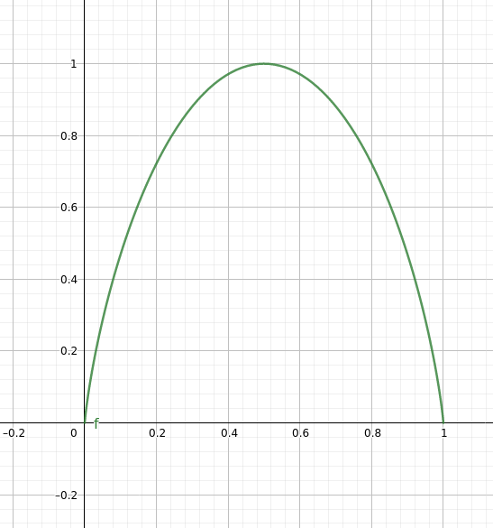

# Informations und Kommunikationstheorie - Aufgabensammlung Lösung

## 1.1 Diskrete Informationsquellen mit unabhängigen Ereignissen

### Aufgabe 1

#### a) 

Berechnung des mittleren Informationsgehaltes (Entropie) einer diskreten Quelle
$$
\begin{align*}
H_{m} &= \sum_{i} p(x_{i}) \cdot \log_{2}{\frac{1}{p(x_{i})}} \\
H_{m} &= 0.5 \cdot \log_{2} \frac{1}{0.5} + 0.2 \cdot \log_{2} \frac{1}{0.2} + 0.1 \cdot \log_{2} \frac{1}{0.1} \cdot 2 + 0.05 \cdot \log_{2} \frac{1}{0.05} \cdot 2 \\
&= 2.06
\end{align*}
$$

#### b)

$$
\begin{align*}
H_{0} &= \lceil log_{2}{N} \rceil \\
H_{0} &= \log_{2}{6} = 2.58 \frac{bit}{QZ}
\end{align*}
$$

### Aufgabe 2

#### a)

Bestimmung der Ergebnisse für $p_{i}$ durch Berechnung der Formel für $ i = 0,1...5$. Berechnung von $H_{m}$ mittels der Formel in Aufgabe 1, dabei ist $p(x_{i})$ jeweils die Ergebnisse einer Zeile.

Beispielrechnung für $i = 1 \Rightarrow 0.1 \cdot \log_{2} \frac{1}{0.1} + 0.9 \cdot \log_{2} \frac{1}{0.9} = 0.47$ 

| $p_{0}(1) = 0 $   | $p_{0}(0) = 1 $   | $H_{m} = 0$    |
| :---------------- | ----------------- | -------------- |
| $p_{1}(1) = 0.1 $ | $p_{1}(0) = 0.9 $ | $H_{m} = 0.47$ |
| $p_{2}(1) = 0.2 $ | $p_{2}(0) = 0.8 $ | $H_{m} = 0.72$ |
| $p_{3}(1) = 0.3 $ | $p_{3}(0) = 0.7 $ | $H_{m} = 0.88$ |
| $p_{4}(1) = 0.4 $ | $p_{4}(0) = 0.6 $ | $H_{m} = 0.97$ |
| $p_{5}(1) = 0.5 $ | $p_{5}(0) = 0.5 $ | $H_{m} = 1$    |

#### b)

Durch die Spiegelung an der Stelle 0.5 können die Werte aus Aufgabe 2 verwendet und die Kurve annähernt genau zu zeichnen werden. 

### Aufgabe 3

Bevor der Informationsgehalt errechnet werden kann muss die Anzahl der Zeichen pro Seite berechnet werden: 

$40 \cdot 65 = 2600 \frac{Zeichen}{Seite}$

Durch die Unabhängigkeit der Zeichen kann angenommen werden, dass die Zeichen mit einer gleichen Wahrscheinlichkeit auftreten. Deshalb kann die Entropie Berechnung auf den log der 45 Zeichen heruntergebrochen werden.  

$$
H_{0} = \log_{2}45 \cdot 2600 Zeichen = 5.5 \cdot 2600 Zeichen = 14.3 * 10^3 \frac{bit}{Seite}
$$

### Aufgabe 4

#### a)

Da keine einzel Wahrscheinlichkeiten der einzelnene Messwerte vorliegt, wird von einer Gleichverteilung ausgegangen. Zu Beachten ist, dass der Bereich bei 0 atartet und somit 101 Schritte umwasst und nicht nur 100. 
$$
H_{0} = \log_{2}101 = 6.66 \frac{bit}{Messwert}
$$
#### b)

Wie in der Teilaufgabe a) muss von einer Gleichverteilung ausgegangen werden. Nur die Schrittweise hat sich verkleinert. Die Berechnung bleibt gleich.
$$
H_{0} = \log_{2} 1001 = 9.97 \frac{bit}{Messwert}
$$

### Aufgabe 5

#### a)

Zur Berechnung der Entropie der Quelle wird die allgmeine Formel verwendet. Das Ergebnis muss zum Abschluss noch mit der Anzahl der Bildschirmeinheiten verrechnet werden.
$$
\begin{align*}
H_{m} &= 0.5 \cdot \log_{2} \frac{1}{0.5} + 0.25 \cdot \log_{2} \frac{1}{0.25} + 0.125 \cdot \log_{2} \frac{1}{0.125} + 0.0625 \cdot \log_{2} \frac{1}{0.0625} \cdot 2 \\
&= 1.875 \frac{bit}{QZ} \\ 
&\Rightarrow 1.88 \cdot 10^3 \frac{bit}{Bild}
\end{align*}
$$

#### b)

Wenn keine Information über die Helligkeitsstufen vorliegt, wird von einer Gleichverteilung ausgegangen. Somit muss nur der ld von N in diesem Fall 5 Helligkeitsstufen berechnet werden. Zum Schluss muss die Entropie noch mit der Anzahl der Bildschirmeinheiten verrechnet werden. 
$$
\begin{align*}
H_{0} &= \log_{2} 5 = 2.32 \frac{bit}{QZ} \\
&\Rightarrow 2.32 \cdot 10^3 \frac{bit}{Bild}
\end{align*}
$$

### Aufgabe 6

#### a)

$$
\begin{align*}
H_{m} &= 0.47 \cdot \log_{2} \frac{1}{0.47} + 0.25 \cdot \log_{2} \frac{1}{0.25} + 0.13 \cdot \log_{2} \frac{1}{0.13} + 0.07 \cdot \log_{2} \frac{1}{0.07} + 0.04 \cdot \log_{2} \frac{1}{0.04} + 0.02 \cdot \log_{2} \frac{1}{0.02} \cdot 2 \\
&= 2.07 \frac{bit}{Amplitudenwert}
\end{align*}
$$

#### b)

$$
H_{m} = 2.07 \cdot \log_{2}16 = 6.07 \frac{bit}{Amplitudenwert}
$$

### Aufgabe 7

$$
H_{m} = \frac{1}{6} \cdot (\log_{2} 6 + \log_{2} 25) + \frac{1}{3} \cdot (\log_{2} 3 + \log_{2} 45) + \frac{1}{2} \cdot (\log_{2} 2 + \log_{2} 30) = 6.52 \frac{bit}{Zahl}
$$

$$
H_{0} = \log_{2} 100 = 6.64 \frac{bit}{Zahl}
$$

### Aufgabe 8

$$
H_{m} = 0.5 \cdot \log_{2} \frac{1}{0.5} + 0.2 \cdot \log_{2} \frac{1}{0.2} + 0.1 \cdot \log_{2} \frac{1}{0.1} \cdot 2 + 0.05 \cdot \log_{2} \frac{1}{0.05} \cdot 2 = 2.06 \frac{bit}{QZ}
$$

Streuung:
$$
\sigma² =0.5 \cdot (\log_{2}2 - 2.06)² + 0.2 \cdot (\log_{2} \frac{1}{0.2} - 2.06)² + 0.1 \cdot (\log_{2}\frac{1}{0.1} - 2.06)² + 0.1 \cdot (\log_{2} \frac{1}{0.1} - 2.06)² + 0.05 \cdot (\log_{2} \frac{1}{0.05} - 2.06)² \cdot 2 = 1.406
$$
Standartabweichung:
$$
\sigma = \sqrt{\sigma²} = 1.19
$$

## 1.2 Diskrete Informationsquellen mit abhängigen Ereinissen

### Aufgabe 1

#### a)

$$
\begin{align*}
\bar{p_{1}} &= 0.6 \cdot \bar{p_{1}} + 0.15 \cdot \bar{p_{2}} + 0.4 \cdot \bar{p_{3}} \\
\bar{p_{2}} &= 0.38 \cdot \bar{p_{1}} + 0.8 \cdot \bar{p_{2}} + 0.6 \cdot \bar{p_{3}} \\
1 &= \bar{p_{1}} + \bar{p_{2}} + \bar{p_{3}} \\
\end{align*} \\
\rule{200pt}{0.4pt}\\
$$

$$
\begin{align*}
0 &= 0.15 \cdot \bar{p_{2}} + 0.4 \cdot \bar{p_{3}} - 0.4 \cdot \bar{p_{1}}\\
0 &= 0.38 \cdot \bar{p_{1}} +  0.6 \cdot \bar{p_{3}} - 0.2 \cdot \bar{p_{2}}\\
1 &= \bar{p_{1}} + \bar{p_{2}} + \bar{p_{3}} \\
\end{align*} \\
$$

Berechnung der stationäre Wahrscheinlichkeiten über das Gleichungssystem (online, Taschenrechner oder Gauß Verfahren).

$\bar{p_{1}} = 0.29$ 	$\bar{p_{2}} = 0.67$ 	$\bar{p_{3}} = 0.04$

#### b)

$$
\begin{align*}
H_{M} &= \bar{p_{1}} \cdot (0.6 \cdot \log_{2}{\frac{1}{0.6}} + 0.38 \cdot \log_{2}{\frac{1}{0.38}} + 0.02 \cdot \log_{2}{\frac{1}{0.02}}) + \\
& \bar{p_{2}} \cdot (0.15 \cdot \log_{2}{\frac{1}{0.15}} + 0.8 \cdot \log_{2}{\frac{1}{0.8}} + 0.05 \cdot \log_{2}{\frac{1}{0.05}}) + \\
& \bar{p_{3}} \cdot (0.4 \cdot \log_{2}{\frac{1}{0.4}} + 0.6 \cdot \log_{2}{\frac{1}{0.6}}) \\
&= 0.97 \frac{bit}{Zeichen}
\end{align*}
$$

#### c)

$$
H_{m} = 0.29 \cdot \log_{2}{\frac{1}{0.29}} + 0.67 \cdot \log_{2}{\frac{1}{0.67}} + 0.04 \cdot \log_{2}{\frac{1}{0.04}} = 1.09 \frac{bit}{Zeichen}
$$

#### d)

$$
H_{0} = \log_{2}{3} = 1.58 \frac{bit}{Zeichen}
$$

